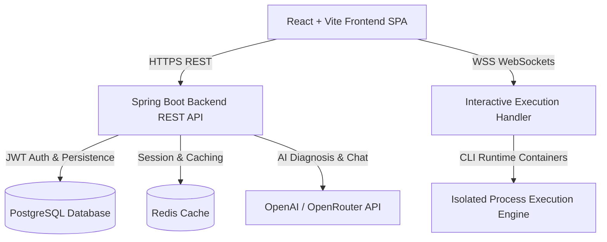

# DevNova AI — Next-Gen Cloud-Native AI IDE & Code Sandbox

<p align="center">
  
  
  
  
  
  
</p>

DevNova AI is a full-stack, cloud-native Web IDE and multi-language code execution sandbox. It combines real-time interactive terminal execution with an AI developer suite for automated code diagnosis, patch auto-fixing, Big-O complexity analysis, and pair programming.

---

## 🌟 Key Features

### ⚡ Multi-Language Code Execution Sandbox
- **Batch REST & Interactive WebSockets**: Real-time stdin/stdout code execution for **Python**, **Java**, **C++**, and **JavaScript**.
- **Process Isolation**: Secure execution containers with timeout protection and process status indicators.
- **Terminal Console**:
  - Live elapsed execution timer & status metrics (exit code, duration ms).
  - Search log filter, copy stdout/stderr, download execution logs.
  - Multi-terminal tab support and execution run history tracking.

### 🤖 DevNova AI Developer Suite
- **Error Diagnosis & Plain English Explanations**: Instant analysis of compile and runtime stack traces.
- **AI Auto-Fix Patches**: Automated code repair displaying fixed code, changes made, and reasoning.
- **Big-O Complexity Analyzer**: Evaluates time & space complexity with optimization recommendations.
- **Unit Test Case Generator**: Generates normal, boundary, and edge test case vectors.
- **Static Code Audit & Quality Review**: Assigns quality scores and checks for best practices.
- **Persistent AI Chat**: Chat history automatically saved and restored per workspace project.

### 💻 Modern Web IDE & Workspace Editor
- **Monaco Code Editor**: Powered by VS Code's editor engine with code folding, minimap, and auto-save.
- **Multi-Tab File Management**: Open, reorder, and switch between workspace files seamlessly.
- **File Explorer Context Menu**: Right-click context menus for **New File**, **New Folder**, **Inline Rename**, **Duplicate**, and **Delete**.
- **Project Breadcrumbs**: File tree navigation header (`Project > Path > File`).

### 🎨 Theme & Personalization Architecture
- **7 Popular IDE Themes**: *DevNova Purple*, *Tokyo Night*, *One Dark Pro*, *Nord*, *Dracula*, *GitHub Dark*, and *Monokai Pro*.
- **Mandatory Light & Dark Mode**: Instant 1-click theme switching saved to `localStorage`.
- **Custom RGB & Color Picker**: Custom primary accent and canvas background customizers with live preview.

---

## 🏗️ System Architecture



---

## 🛠️ Technology Stack

| Layer | Technologies |
|---|---|
| **Frontend** | React 18, TypeScript, Vite, Monaco Editor (`@monaco-editor/react`), Lucide Icons, Zustand State Management |
| **Backend** | Java 17, Spring Boot 3.3, Spring Security (JWT), Spring WebSockets, Spring Data JPA |
| **Databases & Cache** | PostgreSQL 16, Redis 7 |
| **Containerization** | Docker, Docker Compose, Nginx |

---

## 🚀 Quick Start (Local Development)

### Prerequisites
- **Java 17 JDK**
- **Node.js 18+** & `npm`
- **Maven 3.8+**
- **PostgreSQL** & **Redis** (or Docker)

### 1. Database Setup with Docker Compose
Start PostgreSQL and Redis with 1 command:
```bash
docker-compose up -d
```

### 2. Start Backend Server
```bash
cd backend
mvn spring-boot:run
```
*Backend runs at [http://localhost:8080](http://localhost:8080)*

### 3. Start Frontend Dev Server
```bash
cd frontend
npm install
npm run dev
```
*Frontend app opens at [http://localhost:5173](http://localhost:5173)*

---

## 📦 Production Cloud Deployment

DevNova AI is deployment-ready for cloud hosts:

- **Frontend (Vercel / Netlify)**: Pre-configured SPA rewrite rules in [`vercel.json`](frontend/vercel.json) and [`_redirects`](frontend/public/_redirects).
- **Backend (Render / Railway / AWS)**: Docker container build ready via [`backend/Dockerfile`](backend/Dockerfile).

For detailed deployment steps, see the [Cloud Deployment Guide](cloud_deployment_guide.md).

---

## 📜 License

Distributed under the MIT License. See `LICENSE` for details.
